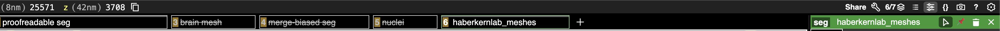
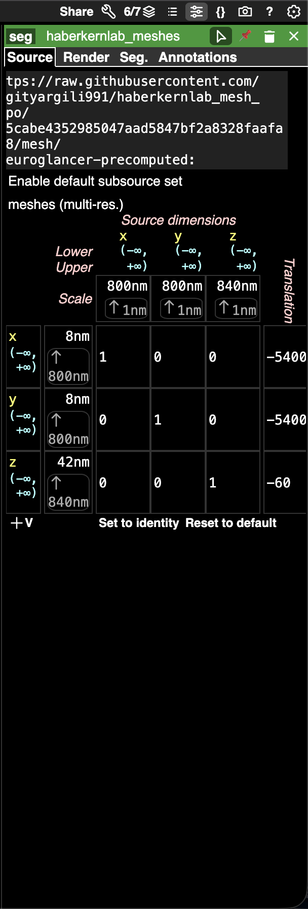

# crantconnectome-haberkernlab-meshcreation

Mesh creation workflow for the Haberkern Lab for clonal raider ant connectome (CRANTb).

## Overview

This is a simple CLI workflow that uses [Igneous](https://github.com/seung-lab/igneous) mesh generation tasks in the backend. The idea is to use 3D TIFF images of meshes (generated in Thermo Fisher AMIRA) to generate neuropil meshes that can be visualized in [Neuroglancer](https://github.com/google/neuroglancer).

## Installation

```bash
uv sync
```

## Usage

```bash
python tiff_to_mesh.py --d <directory or path to your 3d tiff file> \
                       --out <your output directory> \
                       --res <resolution of your mesh> \
                       --unsharded \
                       --setgit
```

**Flags:**

| Flag | Description | Default |
|------|-------------|---------|
| `--d` | Directory containing your 3D TIFF file, or path to a `.tif` file directly (required) | - |
| `--out` | Output directory for meshes | Same as `--d` (parent directory if `--d` is a file) |
| `--res` | Output resolution in nm for aligned meshes (three integers) | `800 800 840` |
| `--unsharded` | Use [unsharded](https://github.com/google/neuroglancer/blob/master/src/datasource/precomputed/meshes.md#unsharded-storage-of-multi-resolution-mesh-manifest) mesh format (default is [sharded](https://github.com/google/neuroglancer/blob/master/src/datasource/precomputed/meshes.md#sharded-storage-of-multi-resolution-mesh-manifest)) | Sharded |
| `--setgit` | Initialize a git repo in output for Neuroglancer | Disabled |

### Example

```bash
python tiff_to_mesh.py --d ./my_segmentation.tif \
                       --out ./meshes \
                       --res 800 800 840 \
                       --setgit
```

## Adding the Mesh to Neuroglancer

After running with `--setgit`, push the generated mesh to GitHub. Then add it to your Neuroglancer state:

1. Click the **+** button to add a new source
2. Paste the raw GitHub content URL pointing to your mesh directory:

```
https://raw.githubusercontent.com/<username>/<repo>/<commit>/mesh/|neuroglancer-precomputed:
```



3. To align the mesh with the EM segmentation, set a source transform translation in the Neuroglancer layer settings (e.g. `-5400 -5400 -60` nm for CRANTb neuropils).



## Alignment

The mesh info transform contains only the resolution scaling (e.g. `[800, 800, 840]`). Translation is **not** baked into the mesh metadata.

- **Neuroglancer**: Apply the translation via the layer source transform in the UI.


## Output Structure

The output follows the [Neuroglancer precomputed format](https://github.com/google/neuroglancer/blob/master/src/datasource/precomputed/README.md). The top-level `info` file describes the volume (data type, resolution, chunk layout), and the `mesh/` subdirectory contains multi-resolution Draco-compressed meshes generated by [Igneous](https://github.com/seung-lab/igneous).

```
output_volume/
├── info              # Precomputed volume metadata (JSON)
├── <scale_key>/      # Raw segmentation chunks
├── mesh/             # Generated meshes
│   ├── info          # Mesh metadata (JSON)
│   └── *.shard       # Sharded mesh files (or per-segment files if --unsharded)
└── .git/             # Git repo (if --setgit)
```
