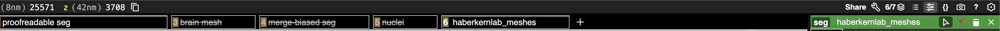

# crantconnectome-haberkernlab-meshcreation

Mesh creation workflow for the Haberkern Lab for clonal raider ant connectome (CRANTb).

## Overview

This is a simple CLI workflow that uses [Igneous](https://github.com/seung-lab/igneous) mesh generation tasks in the backend. It accepts 3D TIFF segmentation images (e.g. from Thermo Fisher AMIRA) or STL mesh files and generates neuropil meshes that can be visualized in [Neuroglancer](https://github.com/google/neuroglancer).

## Installation

```bash
uv sync
```

## Usage

```bash
python tiff_to_mesh.py --d <directory or path to your 3d tiff file> \
                       --out <your output directory> \
                       --res <resolution of your mesh> \
                       --label-file ./labels/neuropils.csv \
                       --setgit              # or --push <repo_name>
```

**Flags:**

| Flag | Description | Default |
|------|-------------|---------|
| `--d` | Directory containing your 3D TIFF/STL file(s), or path to a `.tif`/`.stl` file directly (required) | - |
| `--out` | Base output directory; files are written to `<out>/output_volume/` | Same as `--d` (parent directory if `--d` is a file) |
| `--res` | Output resolution in nm for aligned meshes (three integers) | `800 800 840` |
| `--voxel-offset` | Override the voxel offset for TIFF inputs | `-54 -54 -3` |
| `--unsharded` | Use [unsharded](https://github.com/google/neuroglancer/blob/master/src/datasource/precomputed/meshes.md#unsharded-storage-of-multi-resolution-mesh-manifest) mesh format (default is [sharded](https://github.com/google/neuroglancer/blob/master/src/datasource/precomputed/meshes.md#sharded-storage-of-multi-resolution-mesh-manifest)) | Sharded |
| `--label-file` | CSV file with segment names (`id,name`); accepts common spreadsheet-exported CSVs | None |
| `--labels` | Manual segment names like `1:ellipsoid_body 2:fan_shaped_body` | Auto-derived from TIFF labels or STL filenames |
| `--setgit` | Initialize a git repo in output for Neuroglancer | Disabled |
| `--push REPO_NAME` | Create a new public GitHub repo, initialize git if needed, push mesh output, and print Neuroglancer raw link (requires `gh` CLI; implies `--setgit`) | Disabled |

### Example

```bash
python tiff_to_mesh.py --d ./my_segmentation.tif \
                       --out ./meshes \
                       --res 800 800 840 \
                       --label-file ./neuropil_labels.csv \
                       --setgit
```

## Adding the Mesh to Neuroglancer

When using `--push`, the raw link is printed automatically. If you only used `--setgit`, push manually and construct the URL yourself.

After running with `--setgit`, push the generated mesh to GitHub. Then add it to your Neuroglancer state:

1. Click the **+** button to add a new source
2. Paste the raw GitHub content URL pointing to your mesh directory:

```
https://raw.githubusercontent.com/<username>/<repo>/<commit>/mesh/|neuroglancer-precomputed:
```



3. The mesh should appear at the correct position automatically — no manual translation needed.

## Alignment

The voxel offset is baked into the mesh metadata by the tool:

- **TIFF inputs**: the default voxel offset is `-54 -54 -3` for CRANTb atlas alignment, or the value passed via `--voxel-offset`.
- **STL inputs**: the original physical position is preserved.

No manual source transform translation is required in Neuroglancer.


## Merging Datastacks

Use `merge_datastacks.py` to combine multiple precomputed datastacks (TIFF-sourced or STL-sourced) into a single standalone mesh dataset. Each source is meshed independently so overlapping structures don't interfere with each other's mesh surfaces.

**Important:** `--unsharded` is required for merge. The sharded format names mesh fragments by chunk coordinates, causing sources to overwrite each other since they share the same padded volume shape. Unsharded format names files by segment ID, which is unique across sources.

```bash
python merge_datastacks.py stack_A stack_B \
    --out ./merged \
    --unsharded
```

**Flags:**

| Flag | Description | Default |
|------|-------------|---------|
| `datastacks` | Two or more datastack directories to merge (positional) | - |
| `--out` | Output directory for the merged standalone mesh dataset (required) | - |
| `--unsharded` | **Required for merge.** Use unsharded mesh format | Sharded |
| `--labels` | Manual segment names grouped by source dir (e.g. `--labels stack_A 1:body 2:dendrite`) | Auto-derived from source segment_properties or filenames |
| `--exclude` | Exclude segments by ID or name, grouped by source dir (e.g. `--exclude stack_A 1 3 stack_B PB`) | None |
| `--setgit` | Initialize git repo in output directory | Disabled |
| `--push REPO_NAME` | Create GitHub repo, push output, print Neuroglancer link | Disabled |

The merged output is mesh-only at the repository root. It contains `info`, mesh payload files, `segment_properties/`, and `label_map.json`. It does not contain a raw segmentation scale and should be treated as a publish/view artifact rather than another merge input.

### Excluding Segments

You can exclude specific segments from any source by label ID or name:

```bash
python merge_datastacks.py stack_A stack_B \
    --out ./merged \
    --exclude stack_A 2 stack_B PB
```

Name-based exclusion (e.g. `PB`) is resolved via the source's `segment_properties/info`. If the source has no segment properties, use the numeric label ID instead.

### Overriding a Mesh

To replace a mesh (e.g. swap the PB mesh from stack_A with a new version from stack_B), exclude the old one and include the new:

```bash
python merge_datastacks.py stack_A stack_B_new_pb \
    --out ./merged \
    --exclude stack_A PB
```

### Label Names

Label names are auto-derived in this priority order:
1. Source `segment_properties/info` (works for both TIFF and STL origins)
2. STL filenames (fallback for older datastacks without segment properties)
3. Generic `{dirname}_label_{id}` fallback

Use `--labels` to manually override any name.

## Generated Meshes

Latest CRANTb neuropil meshes we created: [haberkernlab_mesh_repo](https://github.com/yigityargili991/haberkernlab_mesh_repo) ([v0.3.0](https://github.com/yigityargili991/haberkernlab_mesh_repo/releases/tag/v0.2.0))

Neuroglancer URL:
```
https://raw.githubusercontent.com/yigityargili991/haberkernlab_mesh_repo/54d7b1daaa53f23acc14ff34d6c2e728ad6e9254/mesh/|neuroglancer-precomputed:
```

## Output Structure

The output follows the [Neuroglancer precomputed format](https://github.com/google/neuroglancer/blob/master/src/datasource/precomputed/README.md). The top-level `info` file describes the volume (data type, resolution, chunk layout), and the `mesh/` subdirectory contains multi-resolution Draco-compressed meshes generated by [Igneous](https://github.com/seung-lab/igneous).

```
output_volume/
├── info              # Precomputed volume metadata (JSON)
├── <scale_key>/      # Raw segmentation chunks
├── mesh/             # Generated meshes
│   ├── info          # Mesh metadata (JSON)
│   └── *.shard       # Sharded mesh files (or per-segment files if --unsharded)
└── .git/             # Git repo (if --setgit or --push)
```

Merged outputs from `merge_datastacks.py` are published differently:

```
merged_mesh/
├── info                   # Standalone mesh metadata (JSON)
├── *.shard                # Sharded mesh files (default)
├── <segment-id>           # Unsharded mesh data files (with --unsharded)
├── <segment-id>.index     # Unsharded manifests (with --unsharded)
├── segment_properties/
│   └── info               # Label names for the merged mesh dataset
├── label_map.json         # Mapping from source labels to merged labels
└── .git/                  # Git repo (if --setgit or --push)
```
