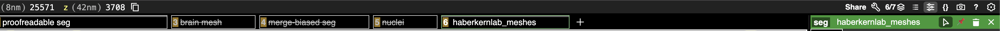

# crantconnectome-haberkernlab-meshcreation

Mesh creation workflow for the Haberkern Lab for clonal raider ant connectome (CRANTb).

## Overview

This package uses [Igneous](https://github.com/seung-lab/igneous) mesh generation tasks in the backend. It accepts 3D TIFF segmentation images (e.g. from Thermo Fisher AMIRA) or STL mesh files and generates neuropil meshes that can be visualized in [Neuroglancer](https://github.com/google/neuroglancer). The same workflows are available through the existing command-line interface and through functional or object-oriented Python APIs.

## Installation

```bash
uv sync
```

This installs the `mesh_creation` package and the `tiff-to-mesh` and `merge-datastacks` commands in the project environment. To install with pip instead:

```bash
python -m pip install .
```

When using `uv sync` without activating the environment, prefix installed commands with `uv run`.

## TIFF/STL Conversion CLI

The installed command is:

```bash
tiff-to-mesh --d <directory or path to your 3d tiff file> \
             --out <your output directory> \
             --res <resolution of your mesh> \
             --label-file ./labels/neuropils.csv \
             --setgit              # or --push <repo_name>
```

The existing script remains supported with the same arguments and output behavior:

```bash
python tiff_to_mesh.py --d <directory or path to your 3d tiff file> \
                       --out <your output directory> \
                       --res <resolution of your mesh> \
                       --label-file ./labels/neuropils.csv \
                       --setgit              # or --push <repo_name>
```

**Flags:**

| Flag | Description | Default |
|------|-------------|---------|
| `--d` | Directory containing your 3D TIFF/STL file(s), or path to a `.tif`/`.stl` file directly (required) | - |
| `--out` | Base output directory; files are written to `<out>/<input-name>/` | A directory input is written in place; a file input is written to `<file-parent>/<file-stem>/` |
| `--res` | Output resolution in nm for aligned meshes (three integers) | `800 800 840` |
| `--voxel-offset` | Override the voxel offset for TIFF inputs | `-54 -54 -3` |
| `--unsharded` | Use [unsharded](https://github.com/google/neuroglancer/blob/master/src/datasource/precomputed/meshes.md#unsharded-storage-of-multi-resolution-mesh-manifest) mesh format (default is [sharded](https://github.com/google/neuroglancer/blob/master/src/datasource/precomputed/meshes.md#sharded-storage-of-multi-resolution-mesh-manifest)) | Sharded |
| `--label-file` | CSV file with segment names (`id,name`); accepts common spreadsheet-exported CSVs | None |
| `--labels` | Manual segment names like `1:ellipsoid_body 2:fan_shaped_body` | Auto-derived from TIFF labels or STL filenames |
| `--setgit` | Initialize a git repo in output for Neuroglancer | Disabled |
| `--push REPO_NAME` | Create a new public GitHub repo, initialize git if needed, push mesh output, and print Neuroglancer raw link (requires `gh` CLI; implies `--setgit`) | Disabled |

### Example

```bash
tiff-to-mesh --d ./my_segmentation.tif \
             --out ./meshes \
             --res 800 800 840 \
             --label-file ./neuropil_labels.csv \
             --setgit
```

This writes the dataset to `./meshes/my_segmentation/`. `python tiff_to_mesh.py` can be substituted for `tiff-to-mesh` in every example.

## Python Conversion API

`tiff_to_mesh()` and its exact alias `create_mesh()` expose the CLI workflow as a function. They return the final dataset directory:

```python
from mesh_creation import create_mesh, tiff_to_mesh

dataset = tiff_to_mesh(
    "./my_segmentation.tif",
    output_dir="./meshes",
    resolution=(800, 800, 840),
    voxel_offset=(-54, -54, -3),
    labels={1: "ellipsoid_body", 2: "fan_shaped_body"},
)

# create_mesh(...) accepts the same arguments and performs the same operation.
```

For an object-oriented flow, configure a converter and run it. `convert()` is an alias for `run()`:

```python
from mesh_creation import MeshConverter

converter = MeshConverter(
    input_path="./my_segmentation.tif",
    output_dir="./meshes",
    resolution=(800, 800, 840),
    voxel_offset=(-54, -54, -3),
)
dataset = converter.run()
```

Conversion keeps the CLI default of sharded output; pass `unsharded=True` in Python or `--unsharded` on the command line when unsharded conversion output is wanted.

## Adding the Mesh to Neuroglancer

When using `--push`, the raw link is printed automatically. If you only used `--setgit`, push manually and construct the URL yourself.

After running with `--setgit`, push the generated mesh to GitHub. Then add it to your Neuroglancer state:

1. Click the **+** button to add a new source
2. Paste the raw GitHub content URL pointing to your published output root:

```
https://raw.githubusercontent.com/<username>/<repo>/<commit>/|neuroglancer-precomputed:
```



3. The mesh should appear at the correct position automatically — no manual translation needed.

## Alignment

The voxel offset is baked into the mesh metadata by the tool:

- **TIFF inputs**: the default voxel offset is `-54 -54 -3` for CRANTb atlas alignment, or the value passed via `--voxel-offset`.
- **STL inputs**: the original physical position is preserved.

No manual source transform translation is required in Neuroglancer.

## Merging Datastacks

Use `merge-datastacks` to combine multiple precomputed datastacks (TIFF-sourced or STL-sourced) into a single standalone mesh dataset. Each source is meshed independently so overlapping structures do not interfere with each other's mesh surfaces.

**Important:** pass `--unsharded` for a safe CLI merge. The CLI retains its historical sharded default for byte-for-byte compatibility, but sharded fragments from independent sources can collide because they use the same padded-volume chunk coordinates. Unsharded files are keyed by the newly unique segment IDs.

```bash
merge-datastacks stack_A stack_B \
    --out ./merged \
    --unsharded
```

The legacy launcher uses the same CLI flow and remains supported:

```bash
python merge_datastacks.py stack_A stack_B \
    --out ./merged \
    --unsharded
```

**Flags:**

| Flag | Description | Default |
|------|-------------|---------|
| `datastacks` | Two or more datastack directories to merge (positional) | - |
| `--out` | Output directory for the merged standalone mesh dataset (required) | - |
| `--unsharded` | Use the unsharded format required for safe independent-source merging | Off (the compatibility CLI default is sharded) |
| `--labels` | Manual segment names grouped by source dir (e.g. `--labels stack_A 1:body 2:dendrite`) | Auto-derived from source segment_properties or filenames |
| `--exclude` | Exclude segments by ID or name, grouped by source dir (e.g. `--exclude stack_A 1 3 stack_B PB`) | None |
| `--setgit` | Initialize git repo in output directory | Disabled |
| `--push REPO_NAME` | Create GitHub repo, push output, print Neuroglancer link | Disabled |

The merged output is mesh-only at the repository root. It contains `info`, mesh payload files, `segment_properties/`, and `label_map.json`. It does not contain a raw segmentation scale and should be treated as a publish/view artifact rather than another merge input.

### Python Merge API

Unlike the compatibility CLI, `merge_datastacks()` safely defaults to `unsharded=True`. Source keys in `labels`, `exclude`, and `include` may be absolute paths or basenames that are unique among the inputs. The function returns the same mapping written to `label_map.json`:

```python
from mesh_creation import merge_datastacks

label_map = merge_datastacks(
    ["./stack_A", "./stack_B"],
    "./merged",
    labels={"stack_A": {1: "PB"}},
    exclude={"stack_A": [2], "stack_B": ["obsolete"]},
)
```

The library validates configured label IDs against each source volume by default, so a mistyped `labels`, `exclude`, or `include` ID fails before meshing. `validate_labels=False` is available only when the legacy permissive behavior is intentionally needed.

The object-oriented equivalent is `DatastackMerger.run()`; `merge()` is an alias for `run()`:

```python
from mesh_creation import DatastackMerger

merger = DatastackMerger(
    datastacks=["./stack_A", "./stack_B"],
    output_dir="./merged",
    label_names={"stack_A": {1: "PB"}},
    exclude={"stack_A": [2]},
)
label_map = merger.run()
```

Both APIs mesh each source independently and assign deterministic, contiguous output IDs starting at 1, in input-stack order and then ascending source-label order. Pass `unsharded=False` only when the legacy sharded merge behavior is specifically required.

### Excluding Segments

You can exclude specific segments from any source by label ID or name:

```bash
merge-datastacks stack_A stack_B \
    --out ./merged \
    --unsharded \
    --exclude stack_A 2 stack_B PB
```

Name-based exclusion (e.g. `PB`) is resolved via the source's `segment_properties/info`. If the source has no segment properties, use the numeric label ID instead.

### Replacing Labels

`replace_labels()` performs a group substitution between exactly two datastacks. It excludes the selected labels from stack A (the base), keeps every other label from A, and includes every non-zero label from stack B (the replacement) by default. Set `replacement_labels` to include only a selected group from B instead:

```python
from mesh_creation import replace_labels

label_map = replace_labels(
    base="./stack_A",
    replacement="./stack_B_new_pb",
    labels=["PB"],
    output_dir="./merged",
    replacement_labels=["PB_left", "PB_right"],  # omit to include all of B
)
```

The object-oriented equivalent requires the base first and replacement second:

```python
from mesh_creation import DatastackMerger

merger = DatastackMerger(
    datastacks=["./stack_A", "./stack_B_new_pb"],
    output_dir="./merged",
)
label_map = merger.replace(
    labels=["PB"],
    replacement_labels=["PB_left", "PB_right"],
)
```

Replacement uses the same safe unsharded default as library merging. It is a group-level merge operation, not a voxelwise overwrite: A and B are meshed independently, there is no required one-to-one pairing between excluded and included labels, and source IDs are not preserved. All kept and replacement labels receive the same deterministic contiguous remap used by `merge_datastacks()`.

Additional grouped exclusions can be supplied with `exclude=...`; a `DatastackMerger` object's configured `exclude` mapping is also honored by `.replace()`. Replacement fails if those exclusions would remove every selected contribution from B.

The CLI-compatible form of this operation is still the original exclusion workaround. It includes all labels from the second stack, so use the Python API when only selected replacement labels should be included:

```bash
merge-datastacks stack_A stack_B_new_pb \
    --out ./merged \
    --unsharded \
    --exclude stack_A PB
```

### Label Names

Label names are auto-derived in this priority order:

1. Source `segment_properties/info` (works for both TIFF and STL origins)
2. STL filenames (fallback for older datastacks without segment properties)
3. Generic `{dirname}_label_{id}` fallback

Use `--labels` to manually override any name.

## Generated Meshes

Latest CRANTb neuropil meshes we created: [haberkernlab_mesh_repo](https://github.com/yigityargili991/haberkernlab_mesh_repo) ([v0.3.0](https://github.com/yigityargili991/haberkernlab_mesh_repo/releases/tag/v0.2.0))

Neuroglancer URL:
```
https://raw.githubusercontent.com/yigityargili991/haberkernlab_mesh_repo/54d7b1daaa53f23acc14ff34d6c2e728ad6e9254/|neuroglancer-precomputed:
```

## Output Structure

Conversion output follows the [Neuroglancer precomputed format](https://github.com/google/neuroglancer/blob/master/src/datasource/precomputed/README.md). The top-level `info` file describes the volume (data type, resolution, chunk layout), and the `mesh/` subdirectory contains multi-resolution Draco-compressed meshes generated by [Igneous](https://github.com/seung-lab/igneous). For example, `--d ./my_segmentation.tif --out ./meshes` produces:

```
meshes/my_segmentation/
├── info                    # Precomputed volume metadata (JSON)
├── <scale_key>/            # Raw segmentation chunks
├── mesh/                   # Generated meshes
│   ├── info                # Mesh metadata (JSON)
│   ├── *.shard             # Default sharded payloads, or
│   ├── <segment-id>        # Unsharded payloads with --unsharded
│   └── <segment-id>.index  # Unsharded manifests with --unsharded
├── segment_properties/
│   └── info                # Segment names
└── .git/                   # Git repo (if --setgit or --push)
```

Merged and replacement outputs are mesh-only datasets published directly at `output_dir`. The safe library default and the required `--unsharded` CLI flow produce:

```
merged/
├── info                   # Standalone mesh metadata (JSON)
├── <segment-id>           # Unsharded mesh data files
├── <segment-id>.index     # Unsharded manifests
├── segment_properties/
│   └── info               # Label names for the merged mesh dataset
├── label_map.json         # Mapping from source labels to merged labels
└── .git/                  # Git repo (if --setgit or --push)
```

Explicitly setting `unsharded=False` in the library, or omitting `--unsharded` in the compatibility CLI, produces `*.shard` payloads instead; that legacy mode is not the safe choice for independent-source merges.
